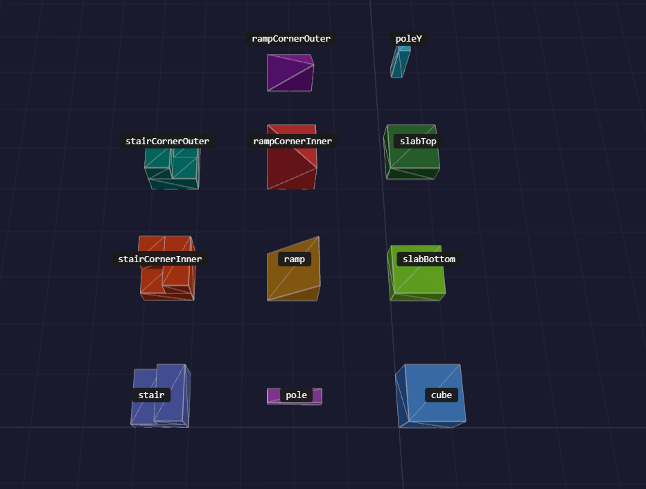

# Built-in shapes

All shapes below are registered automatically by `VoxelEngine`. They are also available
standalone via `BlockShapeRegistry.createDefault()`.

## Class exports

The root package exports each implementation class:

| Class | Constructor | Default ID |
|---|---|---|
| `Cube` | `new Cube(id?)` | `"cube"` |
| `Slab` | `new Slab(type?, id?)` | `"slabBottom"` or `"slabTop"` |
| `Pole` | `new Pole()` | `"pole"` |
| `PoleY` | `new PoleY()` | `"poleY"` |
| `Ramp` | `new Ramp(id?)` | `"ramp"` |
| `RampCornerInner` | `new RampCornerInner(id?)` | `"rampCornerInner"` |
| `RampCornerOuter` | `new RampCornerOuter(id?)` | `"rampCornerOuter"` |
| `Stair` | `new Stair(id?)` | `"stair"` |
| `StairCornerInner` | `new StairCornerInner(id?)` | `"stairCornerInner"` |
| `StairCornerOuter` | `new StairCornerOuter(id?)` | `"stairCornerOuter"` |

`SlabType` is `"top" | "bottom"`; its default is `"bottom"`.

## Shape Reference



### Solid / Slab

All shapes in this category use `collisionHint: "box"`. See
[`VoxelCollider`](../collision/VoxelCollider.md).

| Shape ID | Occludes |
|---:|---|
| `cube` | All faces |
| `slabBottom` | `-Y` |
| `slabTop` | `+Y` |

```ts
type SlabType = "top" | "bottom";
```

Passed to the `Slab` constructor to select which half of the block space the slab occupies.
The default is `"bottom"`.

### Poles / Beams

All pole shapes use `collisionHint: "trimesh"` and occlude no faces because
their cross-section does not fill a voxel.

| Shape ID | Occludes |
|---:|---|
| `poleY` | — |
| `pole` | — |

### Ramps

All ramp shapes use `collisionHint: "trimesh"`.

| Shape ID | Occludes |
|---:|---|
| `ramp` | `-Y`, `+Z` |
| `rampCornerInner` | `-Y`, `+Z`, `+X` |
| `rampCornerOuter` | `-Y` |

### Stairs

All stair shapes use `collisionHint: "trimesh"`.

| Shape ID | Occludes |
|---:|---|
| `stair` | `-Y`, `+Z` |
| `stairCornerInner` | `-Y`, `+Z`, `+X` |
| `stairCornerOuter` | `-Y` |

### Inverted / Upside-Down Shapes (`flipY`)

Ceiling ramps, inverted stairs, and similar shapes are produced by setting `flipY: true`
on any voxel rather than using a dedicated shape class. `flipY` mirrors the block geometry
around `y = 0.5`, reverses face winding to preserve correct lighting, and swaps
the `+Y`/`-Y` occlusion directions so face culling against neighbours remains accurate.

```ts
// Ceiling ramp — same geometry as "ramp" but mounted upside-down
engine.setVoxel("Ceiling", {
  position: { x: 2, y: 4, z: 0 },
  blockId: myRampBlock,
  flipY: true
});

// Inverted inner-corner stair
engine.setVoxel("Ceiling", {
  position: { x: 3, y: 4, z: 0 },
  blockId: myStairBlock,
  rotation: VoxelRotation.CW90,
  flipY: true
});
```

`flipY` can be combined freely with `rotation`, `flipX`, and `flipZ`.

Custom implementations use the same `BlockShape` contract. See
[creating custom shapes](../../guides/creating-custom-shapes.md).
